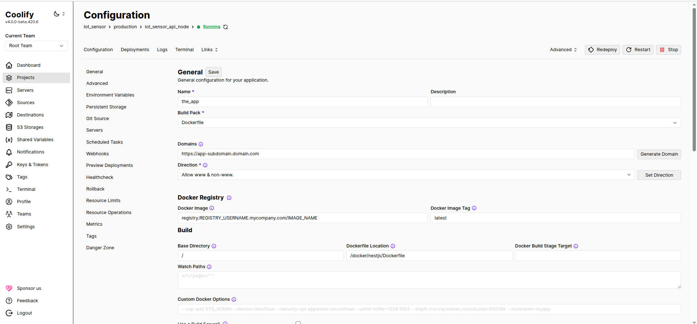

# Docker-registry

This project goal is to have an easy to deploy local regsitry.

I will mostly use this for Coolify instances to provide a complete backup system by saving each deployed images to the local registry.

But you could totaly use it to avoid re pulls of any images


## Installation

First, you must have the following packages installed to your vps :
- docker
- sudo apt install apache2-utils -y (to generate your password for your registry auth)

```bash
# Create a folder at the root of your user ssh folder / when you connect with ssh
mkdir -p externals/docker-registry/{data,auth}

# Create the htpasswd file, giving the auth to the registry
htpasswd -Bbn REGISTRY_NAME REGISTRY_PASSWORD > ./externals/docker-registry/auth/htpasswd
```

Then, you will have to create a subdomain pointing to your VPS<sup>[1](#registry-sub-domain)</sup>, for example `registry.mycompany.com`.

You will have to change in the project all occurences of `registry.mycompany.com` to your sub domain for the project to work.

Now to launch the project, you will have to create a Coolify project for it and launch an application with it based of the `docker-compose.yaml`

### Coolify usage

Since you use a docker registry with auth, you must login into your local docker registry

```
docker login registry.mycompany.com -u REGISTRY_USERNAME -p REGISTRY_PASSWORD
```

The following command will allow Coolify to acess your private registry :

```bash
sudo mkdir -p /root/.docker
sudo cp -r ~/.docker/config.json /root/.docker/config.json
```

Now Coolify should be able to use the registry, we must now indicate to the application which registry to use.



Technicly, just with this we would be good. The registry would be created and each deployment would be saved and we could do our rollback.

> ⚠️ If you put something under the field **Docker image** Coolify will first try to pull that image from the registry based on the current commit (the one being deployed) and if it can't find any only then it will try to build it.

But, the goal is to take it a step further by making our github action doing the build and image tagging.

### Init the CI / CD

> ⚠️ You must remove the auto deploy in this project and in the targeted projects, the auto deploy will be made by the pipeline.

First thing first, to be able to use anything from Coolify externaly (such as make an app deployment with github action) you must:

- Allow the api access
    - `settings > advanced`
- Create the api token
    - `Keys & tokens >` create a token with `deploy` authorization
- Copy the key that is generated

Then, inside your
`settings > environment > production` (or whatever environment you want)

create the following secret variables (you can find thoose under `pipeline.example.env`)

```bash
REGISTRY_URL
# Password set when doing the "htpasswd" command
REGISTRY_PASSWORD
# Username set when doing the "htpasswd" command
REGISTRY_USERNAME
# Token copied when you generate the api token
COOLIFY_API_TOKEN
COOLIFY_APP_ID
# Path of your dockerfile on your project, including the name of the file
DOCKERFILE_PATH
# Url of your Coolify config page
COOLIFY_URL
```

For the `APP_ID` you must go to the configuration of your application, `project > application` choosen and get the end of the url, for example :

`https://my-coolify/project/xxx/environment/xxx/application/APP_ID`

Once this is done, we will add our pipeline.

In your project go to action and create a workflow. Inside you will put the content of the pipeline.example.yml, but before, you must change the values corresponding to your 

## How it works ?

Here i will explain it when using it on a github action pipeline when pushing on main.

1. You push code on main
2. Pipeline starts
    a. builds the image
    b. try to reach the local registry on vps
    c. save the image on the registry
    d. indicates to the Coolify application that it must deploy (your api for example)

By default, it would (and should) try to deploy the `latest` tag which will be generated on each deployment (manual or via pipeline)

## Infos :

<a id="#registry-sub-domain"></a> **Registry sub domain** :

To use the registry outside of your vps, for example in a pipeline, you must expose it.

Therefore it would be better to use a subdomain along with an ssl certificate for secure transactions.

Since Coolify already uses some ports, i had to choose other ones to expose in the `docker.compose`


## Auto delete / Cron

To prevent having too much space taken from your images, you should clean them up frequently.

For this, you can use the `cleanup-registry.sh` inside a cron :

```
0 0 * * * /usr/local/bin/cleanup-registry.sh IMAGE KEEP >> /var/log/registry-cleanup.log 2>&1
```

There are two parameters for this script :
- IMAGE : the image you want to scan
- KEEP : the number of tags you want to keep

So for example :

```
0 0 * * * /usr/local/bin/cleanup-registry.sh api 4 >> /var/log/registry-cleanup.log 2>&1
```

At the end of each day, all tags of the image `api` except the 4 last one will be deleted

> `/usr/local/bin/cleanup-registry.sh` is not a relevant directory you can put it anywhere as long as it doesn't change 